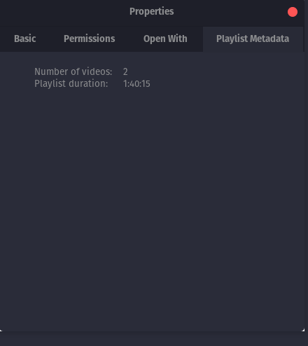

# Nautilus Playlist Duration

# Installation

1. Make sure you install dependencies first

   `sudo apt install python3-nautilus python3-gi`

2. `git clone https://github.com/tw0-face/nautilus-playlist-duration.git`

3. `cd nautilus-playlist-duration`
4. `make install`
5. `nautilus -q` to quit nautilus if it's running

# Uninstallation

1. `cd nautilus-playlist-duration`
2. `make uninstall`
3. `nautilus -q` to quit nautilus if it's running

